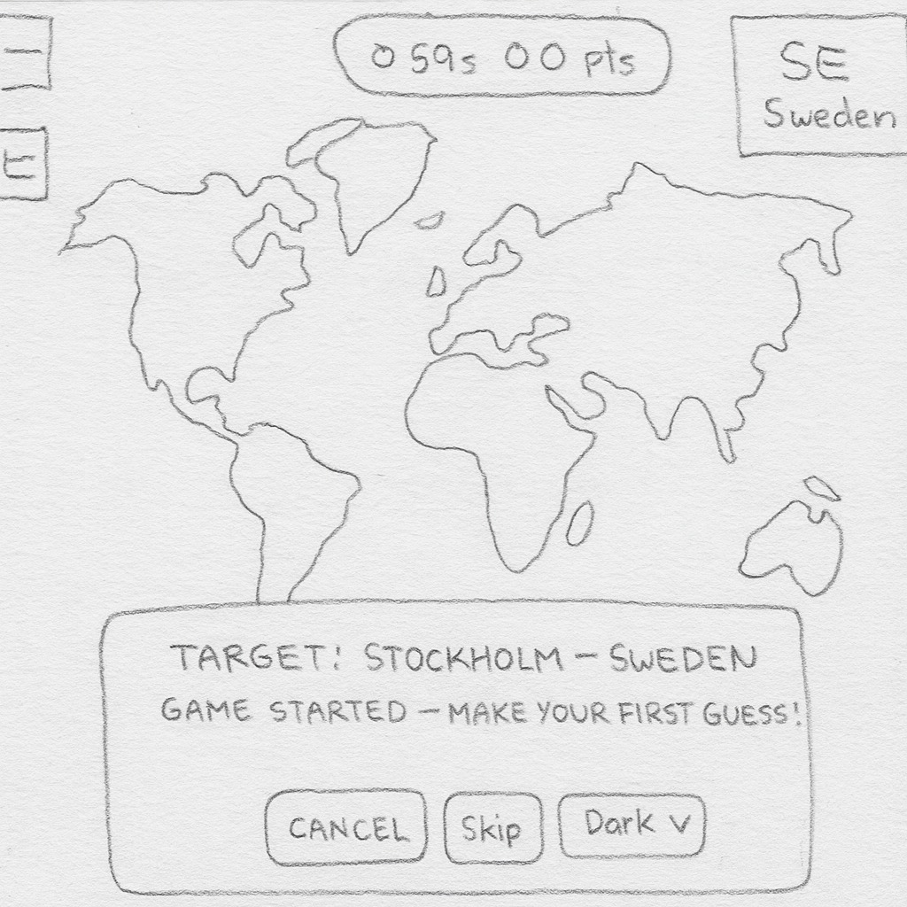

📘 Capitals Game
🖼️ Wireframe / Sketch

🎮 Game Description
This project is a world capitals guessing game. You must guess the targeted capital by clicking on the map. The game features time, life, and score systems.

✨ Features
* Capital guessing by clicking on the world map
* Score system (Points based on distance)
* Life system (Loss of life on wrong guesses)
* Countdown timer (60 seconds)
* Display of the target country's flag, name, and capital
* Both your guess and the correct location are marked with animations on the map
* Mini-map (Leaflet MiniMap)
* Theme options: Dark, Neon, Pastel, Retro
* Game start screen (Intro screen)

🗺️ How to Play
1.  Start the game by pressing the 'Start Game' button.
2.  See the target country and capital information in the top-right corner of the screen.
3.  Make your guess by clicking the point you think is the capital on the map.
4.  Receive points based on the distance between your guess and the actual location:
    * **0–50 km** → 100 points
    * **50–200 km** → 50 points
    * **200–500 km** → 20 points
    * **500 km+** → 0 points (1 life lost)
5.  The game ends if the time runs out or all lives are lost.

🧩 File Structure
* **index.html** → Game interface
* **script.js** → Game mechanics and map operations
* **styles.css** → Design, themes, and animations

🛠️ Technologies Used
* Leaflet.js (Map library)
* Leaflet MiniMap (Mini-map)
* HTML, CSS, JavaScript
* Responsive design
